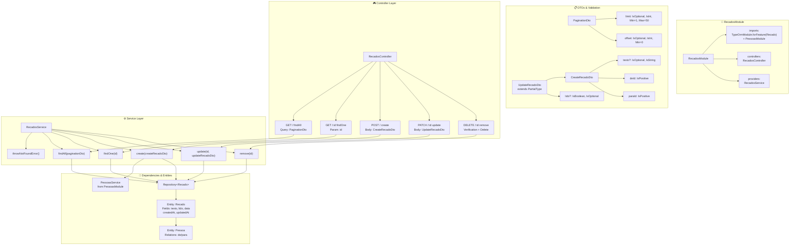

```mermaid
flowchart TB
  subgraph Module["🔧 RecadosModule"]
    RecadosModule["RecadosModule"]
    ImportsRecados["imports:<br/>TypeOrmModule.forFeature(Recado)<br/>+ PessoasModule"]
    ControllersRecados["controllers:<br/>RecadosController"]
    ProvidersRecados["providers:<br/>RecadosService"]
  end

  subgraph DTOs["📋 DTOs & Validation"]
    PaginationDto["PaginationDto"]
    P1["limit: IsOptional, IsInt, Min=1, Max=50"]
    P2["offset: IsOptional, IsInt, Min=0"]
    CreateRecadoDto["CreateRecadoDto"]
    R1["texto?: IsOptional, IsString"]
    R2["deId: IsPositive"]
    R3["paraId: IsPositive"]
    UpdateRecadoDto["UpdateRecadoDto<br/>extends PartialType"]
    R4["lido?: IsBoolean, IsOptional"]
  end

  subgraph Controller["🎮 Controller Layer"]
    CR["RecadosController"]
    RFindAll["GET / findAll<br/>Query: PaginationDto"]
    RFindOne["GET /:id findOne<br/>Param: id"]
    RCreate["POST / create<br/>Body: CreateRecadoDto"]
    RUpdate["PATCH /:id update<br/>Body: UpdateRecadoDto"]
    RRemove["DELETE /:id remove<br/>Verification + Delete"]
  end

  subgraph Service["⚙️ Service Layer"]
    SR["RecadosService"]
    ThrowNotFound["throwNotFoundError()"]
    SFindAll["findAll(paginationDto)"]
    SFindOne["findOne(id)"]
    SCreate["create(createRecadoDto)"]
    SUpdate["update(id, updateRecadoDto)"]
    SRemove["remove(id)"]
  end

  subgraph Dependencies["🔗 Dependencies & Entities"]
    RepoRecado["Repository&lt;Recado&gt;"]
    PessoasServiceDep["PessoasService<br/>from PessoasModule"]
    EntityRecado["Entity: Recado<br/>Fields: texto, lido, data<br/>createdAt, updatedAt"]
    EntityPessoa["Entity: Pessoa<br/>Relations: de/para"]
  end

  RecadosModule --> ImportsRecados
  RecadosModule --> ControllersRecados
  RecadosModule --> ProvidersRecados

  PaginationDto --> P1
  PaginationDto --> P2
  CreateRecadoDto --> R1
  CreateRecadoDto --> R2
  CreateRecadoDto --> R3
  UpdateRecadoDto --> CreateRecadoDto
  UpdateRecadoDto --> R4

  CR --> RFindAll
  CR --> RFindOne
  CR --> RCreate
  CR --> RUpdate
  CR --> RRemove

  RFindAll --> SFindAll
  RFindOne --> SFindOne
  RCreate --> SCreate
  RUpdate --> SUpdate
  RRemove --> SRemove

  SR --> ThrowNotFound
  SR --> SFindAll
  SR --> SFindOne
  SR --> SCreate
  SR --> SUpdate
  SR --> SRemove

  SFindAll --> RepoRecado
  SFindOne --> RepoRecado
  SCreate --> PessoasServiceDep
  SCreate --> RepoRecado
  SUpdate --> RepoRecado
  SRemove --> RepoRecado

  RepoRecado --> EntityRecado
  EntityRecado --> EntityPessoa

  click RecadosModule call linkCallback("c:/workdir/conceitos_nest/src/recados/recados.module.ts")
  click CR call linkCallback("c:/workdir/conceitos_nest/src/recados/recados.controller.ts")
  click SR call linkCallback("c:/workdir/conceitos_nest/src/recados/recados.service.ts")
  click CreateRecadoDto call linkCallback("c:/workdir/conceitos_nest/src/recados/dto/create-recado.dto.ts")
  click UpdateRecadoDto call linkCallback("c:/workdir/conceitos_nest/src/recados/dto/update-recado.dto.ts")
```
